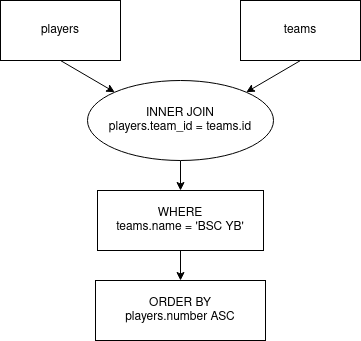

# QueryGraph

## Goal

Visually display the flow of an SQL query. Important: this project does not try
to model the real order of operations in a DBMS, but to show the conceptual
flow of data.

A query like

```sql
SELECT * FROM players INNER JOIN teams ON players.team_id = teams.id WHERE teams.name = 'BSC YB' ORDER BY players.number ASC;
```

should generate a diagram similar to:



## Development

* Install [rust](https://www.rust-lang.org/tools/install) with cargo
* Build: `cargo build`
* Run: `./target/debug/querygraph`
* Build & run: `cargo run`

The build and run commands can also be modified with `--release`.
